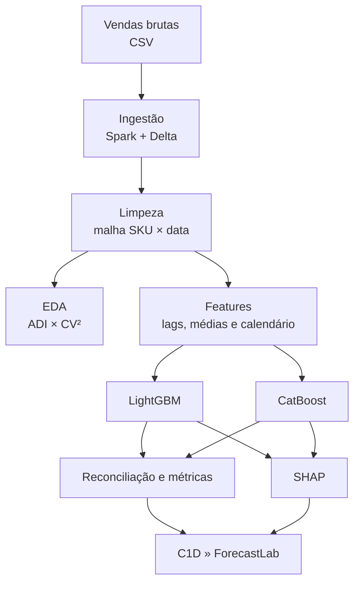

# C1D » ForecastLab

Pipeline de previsão diária de vendas no varejo por SKU, com processamento em Spark/Delta Lake, modelos LightGBM e CatBoost, reconciliação, avaliação, explicabilidade SHAP e dashboard Streamlit.

- Dashboard: [sales-forecasting-for-sku.streamlit.app](https://sales-forecasting-for-sku.streamlit.app/)
- Apresentação: [Forecasting de Vendas no Varejo de Moda](https://github.com/betinaschilling/project_time_series_forecasting/blob/main/Forecasting%20de%20Vendas%20no%20Varejo%20de%20Moda.pdf)

## Visão geral

O projeto transforma o histórico bruto de vendas em previsões diárias por SKU. O pipeline completa datas ausentes, registra imputações, constrói atributos temporais sem vazamento do target, treina dois modelos de gradient boosting e combina suas previsões por média simples.

As explicações SHAP permitem investigar quais atributos sustentam cada previsão, no histórico e no horizonte futuro. O dashboard C1D » ForecastLab reúne resultados, métricas e análises em uma interface editorial.

### Principais capacidades

- ingestão de CSV e persistência intermediária em CSV e Delta Lake;
- expansão da malha diária por SKU e preenchimento de vendas ausentes com zero;
- criação de lags, médias móveis, calendário e indicadores de imputação;
- EDA temporal e classificação de demanda por SKU com ADI × CV²;
- validação temporal com `TimeSeriesSplit`;
- forecast recursivo de sete dias por LightGBM e CatBoost;
- reconciliação por média simples entre os dois modelos;
- métricas nos níveis granular e agregado;
- explicabilidade SHAP global, histórica e futura;
- dashboard Streamlit para exploração dos resultados.

## Arquitetura do pipeline



## Estrutura do projeto

A árvore abaixo substitui o antigo print e mostra os componentes relevantes do repositório. Arquivos dentro de `data/` são entradas ou artefatos produzidos pelo pipeline.

```text
project_time_series_forecasting/
├── README.md
├── setup.py
├── requirements.txt
├── Forecasting de Vendas no Varejo de Moda.pdf
├── data/
│   ├── raw/
│   │   └── vendas.csv
│   ├── interim/
│   │   ├── vendas_interim.csv/
│   │   └── vendas_interim.delta/
│   ├── processed/
│   │   ├── vendas_processed.csv/
│   │   └── vendas_processed.delta/
│   ├── features/
│   │   ├── vendas_features.csv/
│   │   └── vendas_features.delta/
│   ├── eda/
│   │   └── sku_demand_profile.csv
│   ├── models/
│   │   ├── lgbm_model.pkl
│   │   ├── lgbm_model.pkl.metadata.json
│   │   ├── catboost_model.cbm
│   │   ├── catboost_model.cbm.metadata.json
│   │   ├── ml_forecast.csv
│   │   ├── catboost_forecast.csv
│   │   ├── reconciled_sku_forecast.csv
│   │   ├── reconciled_daily_summary.csv
│   │   └── metrics_report.csv
│   ├── explainability/
│   │   ├── shap_global.csv
│   │   ├── shap_local.parquet
│   │   ├── shap_validation.csv
│   │   └── manifest.json
│   └── logs/
│       └── pipeline.log
├── src/
│   ├── ingestion/
│   │   └── loader.py
│   ├── preprocessing/
│   │   └── clean.py
│   ├── features/
│   │   ├── make_features.py
│   │   └── forecasting_features.py
│   ├── eda/
│   │   └── demand_profile.py
│   ├── models/
│   │   ├── train_lgbm.py
│   │   ├── train_catboost.py
│   │   └── reconcile.py
│   ├── evaluation/
│   │   └── metrics.py
│   ├── explainability/
│   │   └── generate_shap.py
│   ├── scripts/
│   │   └── run_sku_forecaster.py
│   └── visualization/
│       └── app.py
└── tests/
    ├── test_forecasting_features.py
    └── test_demand_profile.py
```

> O Spark salva saídas CSV como diretórios contendo arquivos `part-*.csv`; por isso algumas entradas aparecem com uma barra final.

## Dados e preparação

A entrada padrão é `data/raw/vendas.csv`, com os campos:

| Campo | Descrição |
|---|---|
| `sku` | Identificador do produto. |
| `data_venda` | Data da venda na base bruta. |
| `venda` | Quantidade ou medida de demanda modelada. |

Na limpeza, duplicidades de `sku + data` são agregadas por soma. Em seguida, cria-se uma sequência diária completa entre a primeira e a última observação de cada SKU. Datas ausentes recebem `venda = 0` e são identificadas por `is_imputed = True`.

## EDA e perfil da demanda

A etapa `forecast-eda` calcula um perfil fixo por SKU sobre todo o histórico disponível. A classificação segue os limiares ADI = 1,32 e CV² = 0,49:

| Categoria | Regra | Leitura |
|---|---|---|
| Regular | ADI < 1,32 e CV² < 0,49 | Venda frequente e volume estável. |
| Errática | ADI < 1,32 e CV² ≥ 0,49 | Venda frequente e volume variável. |
| Intermitente | ADI ≥ 1,32 e CV² < 0,49 | Venda espaçada e volume relativamente estável quando ocorre. |
| Irregular | ADI ≥ 1,32 e CV² ≥ 0,49 | Venda espaçada e volume variável. |

O ADI é calculado como dias calendários observados divididos por dias com venda. O CV² considera apenas demandas positivas, evitando contar os zeros duas vezes. SKUs sem ocorrência positiva recebem a categoria `Sem demanda`.

O dashboard adiciona:

- filtro global de categoria, aplicado às páginas de EDA, visão executiva, série temporal, SKU, métricas e SHAP local;
- comportamento diário das vendas e média móvel de sete dias;
- quantidade de SKUs ativos por dia;
- distribuição dos perfis;
- mapa ADI × CV² com linhas de corte;
- tabela auditável das estatísticas de cada SKU.

O filtro de período altera os indicadores temporais, mas não recalcula a categoria. Essa decisão mantém o segmento estável durante a navegação.

## Engenharia de atributos

O módulo `features.forecasting_features` centraliza a mesma definição de atributos usada no treino, no forecast recursivo e no SHAP.

| Grupo | Atributos |
|---|---|
| Defasagens | `lag_1`, `lag_7`, `lag_14` |
| Médias móveis | `roll_mean_7`, `roll_mean_14`, `roll_mean_30` |
| Calendário | `weekday`, `is_weekend`, `month` |
| Qualidade | `is_imputed`, `was_imputed` |

As defasagens e médias móveis utilizam somente valores anteriores à linha prevista. No forecast recursivo, cada nova previsão é incorporada ao histórico apenas depois de os atributos daquele horizonte serem calculados.

## Modelagem

### LightGBM e CatBoost

Os dois modelos:

1. leem a base de features;
2. regeneram os atributos pela implementação compartilhada;
3. executam validação temporal com `TimeSeriesSplit`;
4. treinam no histórico completo;
5. persistem modelo e metadados;
6. geram fitted values e previsão recursiva para o horizonte configurado.

O horizonte padrão é de sete dias e o `random_state` é 42.

### Reconciliação

A previsão reconciliada por SKU é uma média simples:

```text
reconciled = (lgbm_pred + cb_pred) / 2
```

Também é produzido um resumo diário agregado com realizado, LightGBM, CatBoost e reconciliado.

### Avaliação

As métricas são calculadas para LightGBM, CatBoost e reconciliado, tanto por SKU/data quanto no agregado diário:

- RMSE;
- MAE;
- MAPE;
- WMAPE;
- R².

## Explicabilidade SHAP

A etapa de explicabilidade utiliza as contribuições nativas dos modelos:

- LightGBM: `predict(..., pred_contrib=True)`;
- CatBoost: `get_feature_importance(..., type="ShapValues")`.

Isso mantém o dashboard sem dependência adicional do pacote `shap`. Para cada observação:

```text
prediction ≈ base_value + soma(shap_value)
```

### Escopo publicado

- 5.696 SKUs presentes na base processada;
- 5.000 observações recentes por modelo para importância global;
- 5.000 observações históricas por modelo para explicações locais;
- 500 SKUs ativos em sete horizontes futuros;
- maior resíduo de aditividade observado: aproximadamente `1,23 × 10⁻¹¹`.

### Artefatos

| Arquivo | Conteúdo |
|---|---|
| `data/explainability/shap_global.csv` | Ranking global por modelo, magnitude média, direção média e proporção de contribuições positivas. |
| `data/explainability/shap_local.parquet` | Contribuições locais em formato longo por SKU, data, horizonte, modelo e feature. |
| `data/explainability/shap_validation.csv` | Resíduo máximo de aditividade e quantidade de linhas por modelo e escopo. |
| `data/explainability/manifest.json` | Arquivos, horizonte, cobertura futura e resultado máximo de validação. |

### Como interpretar

- `shap_value > 0`: a feature eleva a previsão em relação ao valor-base;
- `shap_value < 0`: a feature reduz a previsão;
- `mean_abs_shap`: intensidade global da contribuição, independentemente da direção;
- `positive_share`: frequência com que a contribuição foi positiva na amostra.

Nos artefatos atuais, `is_imputed` é o principal driver global. O resultado mostra que os modelos são sensíveis à disponibilidade e à imputação dos dados. Ele deve ser lido como sinal de qualidade do histórico, e não como relação causal com vendas.

## Instalação

Requisitos principais:

- Python 3.10 ou superior;
- Java compatível com a instalação do PySpark;
- dependências listadas em `requirements.txt`.

```bash
python -m venv .venv
source .venv/bin/activate
python -m pip install --upgrade pip
pip install -e .
```

No Windows PowerShell, ative o ambiente com:

```powershell
.venv\Scripts\Activate.ps1
```

## Execução

Com `data/raw/vendas.csv` disponível, execute o pipeline na ordem:

```bash
forecast-load
forecast-clean
forecast-eda
forecast-features
forecast-train-lgbm
forecast-train-cb
forecast-reconcile
forecast-evaluate
forecast-explain
forecast-dashboard
```

Os comandos aceitam argumentos para substituir caminhos e parâmetros padrão. Consulte cada interface com `--help`, por exemplo:

```bash
forecast-explain --help
forecast-explain --horizon 7 --max-future-skus 500
```

Para gerar a análise de um SKU específico:

```bash
forecast-sku 12345
```

## Dashboard

O comando `forecast-dashboard` inicia o C1D » ForecastLab. A aplicação carrega os artefatos existentes e oferece visões do portfólio, resultados agregados, análise por SKU, métricas e explicabilidade.

A aplicação publicada está disponível em [sales-forecasting-for-sku.streamlit.app](https://sales-forecasting-for-sku.streamlit.app/).

## Testes

Os testes disponíveis verificam que:

- as quatro categorias ADI × CV² respeitam os limiares metodológicos;
- o ADI usa a cobertura calendária e o CV² ignora dias de venda zero;
- SKUs sem demanda positiva são tratados explicitamente;
- lags e médias móveis não usam o target da própria linha;
- o próximo dia é criado antes da previsão;
- o forecast recursivo reaproveita a previsão anterior;
- o histórico fora da janela necessária é descartado.

Para executar:

```bash
pip install pytest
pytest -q
```

## Limitações e próximos passos

- a imputação com zero pode representar ausência de venda ou ausência de registro; a distinção depende da semântica da fonte;
- a validação atual usa `TimeSeriesSplit`, mas pode evoluir para backtesting por janelas móveis e horizontes explícitos;
- a reconciliação é uma média simples e ainda não pondera desempenho recente por modelo ou SKU;
- MAPE pode ser instável em séries com muitos zeros; WMAPE deve ser analisado em conjunto;
- SHAP explica o comportamento do modelo e não estabelece causalidade;
- variáveis comerciais, preço, promoção, estoque, feriados e clima podem ampliar o poder explicativo e preditivo.

## Autoria

Cheila Santos — projeto de forecasting de demanda, engenharia de dados e explicabilidade aplicada ao varejo.
